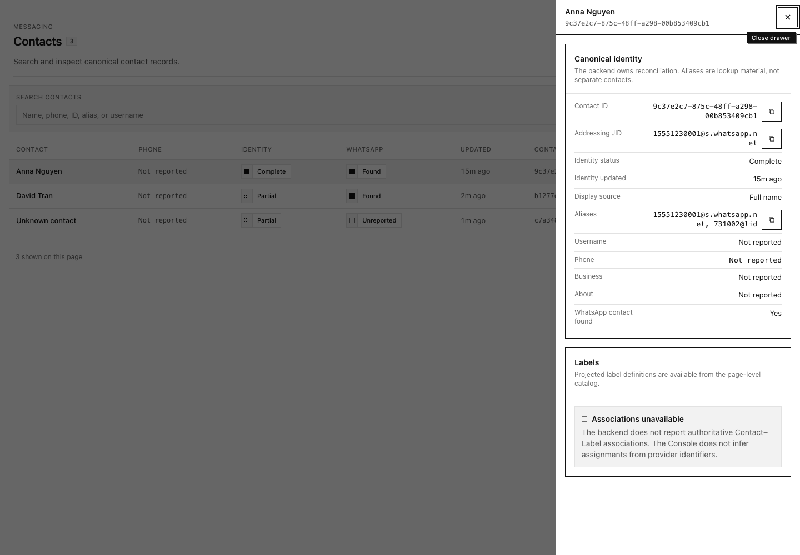
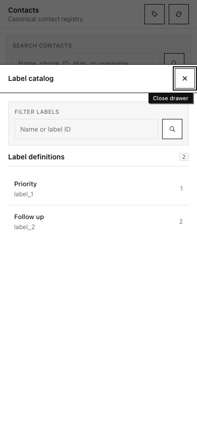
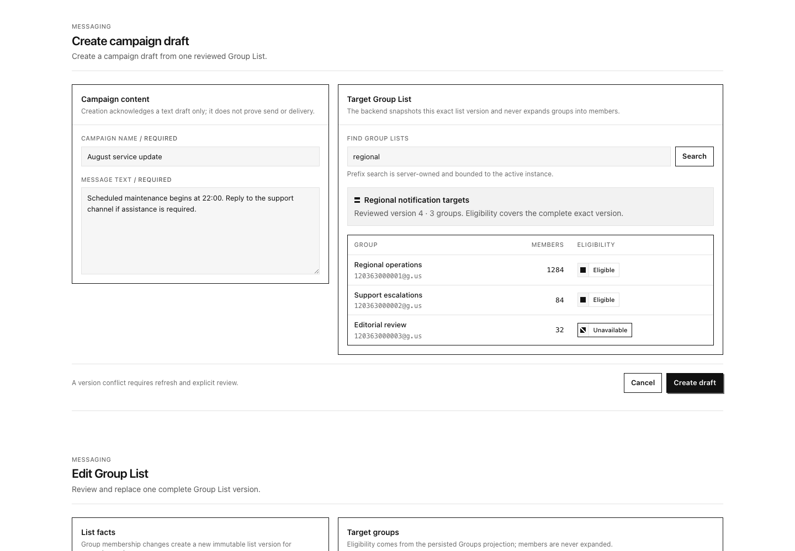
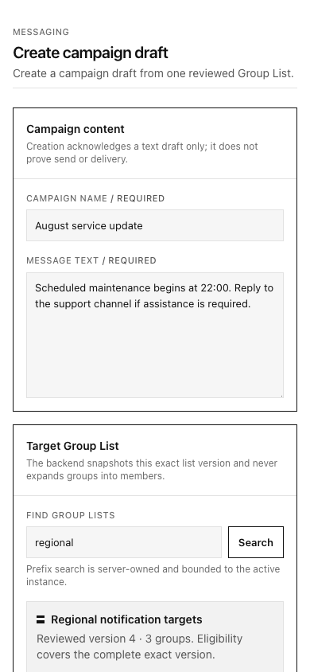

# UI evidence

## Contacts workspace

Chrome DevTools evidence captured on 2026-08-06 from the development-only
`/__preview/contacts` route using production components and deterministic
fixtures.

### Desktop — 1920 × 1080

- Contacts use the full-width responsive registry table rather than the
  Conversation split composition.
- The Label catalog is a closable modal Drawer and does not resize the registry.
- Contact and Label details replace one another in the bounded Drawer instead
  of stacking overlays.

### Mobile — 390 × 844

- The catalog uses the shared modal Drawer and fits the exact 390px viewport
  without horizontal overflow.
- Close receives focus on open. Selecting a Label replaces the catalog list
  with projected definition detail and a `Back to labels` action.
- Closing after opening from the compact `Labels` action restores focus to that
  action.

Chrome DevTools reported no console errors, warnings, or issues during the
desktop and mobile interaction checks.

## Workflow forms

The `/__preview/workflow-forms` route provides deterministic visual coverage for
the Create Campaign and Edit Group List compositions without issuing API reads
or simulating backend authority.

- Desktop uses the production two-column panel proportions and bounded target
  tables.
- Mobile stacks panels and preserves full-width 40px footer actions.
- Long target identifiers wrap without document-level horizontal overflow.
