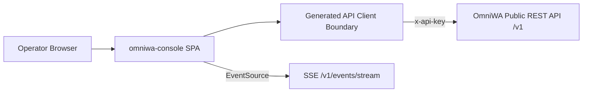

# Architecture

## OmniWA GO backend (current)

This console now targets the **OmniWA GO** API, not the omniwa Platform v1
contract. Key deltas from the sections below (which describe the original
Platform design and are kept for historical context):

- **Contract:** `contracts/omniwa-go.openapi.json`, converted from omniwa-go's
  Swagger 2.0 (`../omniwa-go/docs/swagger.json`) via `pnpm contract:sync`
  (`scripts/sync-omniwa-go-contract.mjs` → `swagger2openapi`). Types regenerate
  with `pnpm api:generate`.
- **Auth:** `apikey` header (global admin key or per-instance token), not
  `x-api-key`. See `docs/AUTH_AND_SESSION.md`.
- **Envelopes:** success is `{ message, data }` (some endpoints return the
  payload raw); errors are `{ error: string }` with category inferred from the
  HTTP status. Commands are always synchronous (no `202`/operation ids). See
  `src/api/envelopes.ts`.
- **Realtime:** disabled — `/ws` needs the global key and is unsafe from a
  browser. Panels poll instead. See `docs/REALTIME.md`.
- **Pagination:** none (flat list endpoints).
- **Panel coverage:** only instances, groups, send, contacts, labels, and
  message actions have an omniwa-go backend. Overview, queue, webhooks, api-keys,
  settings, events, and chats have no backing and their `src/api/` modules throw
  `notImplemented` (category `not_implemented`), which the panels render as an
  unavailable state. The **instances** vertical is wired to live `/instance/*`
  endpoints; **groups** is stubbed pending wiring to `/group/*`.
- **Two client scopes:** admin routes (`/instance/all·info·create·delete`) use
  the session's global key; token-scoped routes
  (`/instance/connect·qr·status·disconnect·reconnect`) act on the instance whose
  token is in the header, so the console builds a per-instance client from each
  instance's `token` (see `useApiSession` and `src/features/instances/hooks.ts`).

Full migration context: `docs/HANDOFF_FROM_OMNIWA_GO.md`.

## Style

`omniwa-console` is a client-only single-page application. There is no
server-side code in this repository. The build output is static assets served
by any web server; all platform state lives in OmniWA and is fetched at
runtime through the public REST API.



## Layers

Dependencies point downward only. A layer may import from layers below it,
never above.

| Layer | Path | Owns | May import |
| --- | --- | --- | --- |
| App shell | `src/app/` | Router, layout, providers, navigation, connect screen wiring | features, components, api, lib |
| Features | `src/features/<panel>/` | One directory per panel: pages, panel-specific components, query hooks | components, api, lib |
| Components | `src/components/` | Reusable presentational components (tables, feedback, badges, empty states, envelope-aware list views) | api, lib |
| API boundary | `src/api/` | Generated types, typed client factory, envelope helpers, query-key conventions, SSE client | lib |
| Lib | `src/lib/` | Session storage, formatting, small utilities | (nothing internal) |

Rules:

- Feature code never imports another feature. Shared logic moves down into
  `components/`, `api/`, or `lib/`.
- Only `src/api/` touches the network. Features consume typed hooks and
  helpers; they never construct URLs or headers.
- `src/api/generated/` is machine-written by `pnpm api:generate` and never
  edited by hand.

## Shared table system

All list panels use the WARP table primitives in
`src/components/data-table/`. Features supply typed columns, data, row
actions, and URL-backed controls; they do not define table breakpoints,
sticky offsets, column geometry, loading layouts, or overflow behavior.

The shared contract provides:

- independent typed column size, content kind, alignment, mobile role, and
  sticky-role presets instead of arbitrary layout classes;
- stable loading, unavailable, empty, and envelope-aware error states inside
  the table geometry;
- separate checked-row and active-row states so bulk selection is not
  confused with an open detail drawer;
- a stationary footer outside the horizontal scroller and automatic edge
  cues while more columns remain off-screen;
- one container-aware responsive policy: full tables when their workspace is
  wider than 620px, compact summaries when a rail or narrow viewport reduces
  the workspace to 620px or less, sticky identity columns on wider tablets,
  and 44px controls for coarse pointers.
- schema-driven compact summaries for standard tables, with a custom summary
  escape hatch only for rows whose mobile hierarchy differs materially;
- selection controls that remain available in compact summaries and keep
  checked state separate from the row whose detail drawer is active;
- shared active-filter chips and filter counts while each feature retains
  ownership of its URL search parameters.

New panels extend the preset vocabulary in the shared component when needed;
they must not add panel-specific row heights, sticky offsets, or responsive
table breakpoints. `pnpm design:check` compares critical geometry between the
production stylesheet and the static prototype stylesheet, and is part of
the required `pnpm check` gate.

## Shared detail drawer system

Resource inspectors and management panels use `DetailDrawer` from
`src/components/drawer/`. Features own their typed content and commands, but
they do not own drawer positioning, breakpoints, overlays, focus management,
or close controls.

The shared contract provides:

- a 440px fixed inspector on workspaces at least 1280px wide, with reserved
  content space so the drawer never covers table columns;
- a modal side sheet below 1280px and a full-width sheet on narrow phones,
  including body scroll lock, inert background content, focus trapping,
  Escape handling, focus restoration, and a 44px close target;
- one shared header action rail: the 32px visual Close control, resource status,
  and 44px Copy target occupy the same right-hand grid column while retaining
  44px interaction targets;
- a single identifier row with truncation, full-value tooltip, and copy
  action instead of repeating IDs in the facts list;
- shared loading, unavailable, and error-state geometry; and
- one content order: identity and status, summary facts, configuration,
  activity or history, recovery actions, then destructive actions last.

Nested confirmation dialogs take keyboard priority over their parent drawer.
Feature drawers may add section content and status-dot semantics, but must not
reimplement the shell or introduce panel-specific responsive behavior.
`pnpm design:check` rejects feature drawers that drift back to owned shell
markup.

## Shared modal system

Command forms, typed confirmations, and one-time secret surfaces use
`ModalDialog` from `src/components/dialog/`. The shared shell owns the
backdrop, maximum viewport height, scrollable body, action footer, compact
Close control, outside-click policy, and responsive placement. Feature code
owns fields, validation, command feedback, and button labels only.

Dialog semantics are proportional to operational risk:

- command forms use primary submission and neutral cancellation;
- reversible confirmations do not require typed input;
- destructive or high-impact confirmations require an explicit phrase or
  stable resource identifier, with danger styling reserved for destructive
  commands;
- show-once secrets use explicit acknowledgement with no ambient Close,
  Escape, or backdrop dismissal.

The shared footer accepts one primary action and an optional secondary action;
features do not own footer grids or mobile spans. Dialog descriptions connect
through `aria-describedby`, pending commands expose `aria-busy`, and headers
show operator-relevant resource identity rather than OpenAPI operation IDs.

Centered command dialogs are 520px wide on desktop; complex administrative
forms may opt into the shared 680px `wide` size. Both retain a 16px viewport
gutter on phones. Their body scrolls independently while the header and footer
remain visible; actions keep 44px touch targets. Long operation or resource
context truncates in the header and exposes its full string through a title.

Mobile navigation and table-filter sheets keep their purpose-specific bottom
sheet layouts, but use the same `useModalDialog` lifecycle and `IconButton`
controls. That lifecycle locks body scroll, makes background branches inert,
traps focus, handles Escape, and restores focus to the originating control.
Open composite controls inside a modal receive the first Escape press so they
close before the owning dialog.
Feature components must not render their own dialog role, overlay, or shell
geometry. `pnpm design:check` enforces these boundaries.

## Automated architecture gates

`pnpm architecture:check` scans the TypeScript source and rejects direct
network access outside `src/api/`, imports from one feature into another, and
feature-owned `main` landmarks. `pnpm bundle:check` runs after the production
build, verifies that route-level page chunks still exist, and rejects any raw
JavaScript chunk larger than 300 KiB. Both checks are included in `pnpm check`.

## Shared feedback system

Transient feedback, scoped API failures, and workspace conditions use the
primitives in `src/components/feedback/`. Features report outcomes through the
provider and keep scoped errors attached to their dialog, drawer, form, or
table. They do not implement panel-specific toast queues, timers, or transport
banners. Query and mutation cache callbacks update browser transport state
without issuing an extra health operation from the shell. See
`docs/FEEDBACK.md` for routing and lifecycle policy.

## Contract-driven boundary

The OpenAPI contract is vendored at `contracts/omniwa-v1.openapi.json` and
synced from the sibling platform repo with `pnpm contract:sync`. The
TypeScript types in `src/api/generated/schema.d.ts` are generated from the
vendored copy, so this repo builds standalone without the platform repo
checked out.

This mirrors the OmniWA Phase J guardrail: platform clients consume the
public OpenAPI surface only. The generated client plays the role the Rust
`omniwa-sdk` plays for `omniwa-tui`.

## State model

- **Server state** is owned by TanStack Query. Every read maps to one
  OpenAPI operation; query keys follow the convention in
  `docs/API_CLIENT.md`. Mutations invalidate the affected keys.
- **Realtime** events from SSE do not write into caches directly; they
  trigger targeted invalidation (see `docs/REALTIME.md`).
- **Session state** (API base URL, API key, key kind) lives in
  `sessionStorage` behind `src/lib/session.ts` (see
  `docs/AUTH_AND_SESSION.md`).
- **UI state** (filters, selected rows, open drawers) lives in URL search
  params first, component state second — panels should be deep-linkable.

## Routing

The messaging workflow is primary; operations panels are secondary:

```
/connect
/chats/:instanceId?/:chatId?         # primary: adaptive direct-conversation workspace
                                     #   ?pane=conversations|context selects the compact pane
/groups/:instanceId?                 # primary: group management table
                                     #   ?list=nl_* opens the Named Lists panel mode
/messages                            # campaigns (proposed contract)
/messages/new                        # campaign wizard (proposed)
/overview
/instances
/instances/:instanceId
/queue
/webhooks
/webhooks/:webhookId
/events
/settings
/settings/api-keys
```

The workspace remembers the instance, chat, compact-layout pane, filters, and
selected message in the URL so every operator context is a shareable deep
link. Desktop renders conversation, timeline, and context panes together;
tablet preserves the conversation list beside one detail pane; mobile renders
one pane with contextual back navigation. Unauthenticated visits to any route
redirect to `/connect`.

## Error and safety posture

- The API never returns secrets, raw phone/JID, or provider payloads; the
  console renders what the contract provides and adds no client-side
  reconstruction of redacted data.
- Error envelopes surface with their product-safe category and retryability
  flag; the console never shows stack traces or invents error detail.
- The API key is displayed nowhere after entry (see
  `docs/AUTH_AND_SESSION.md`).
