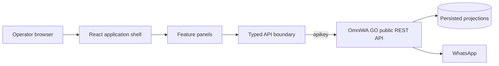
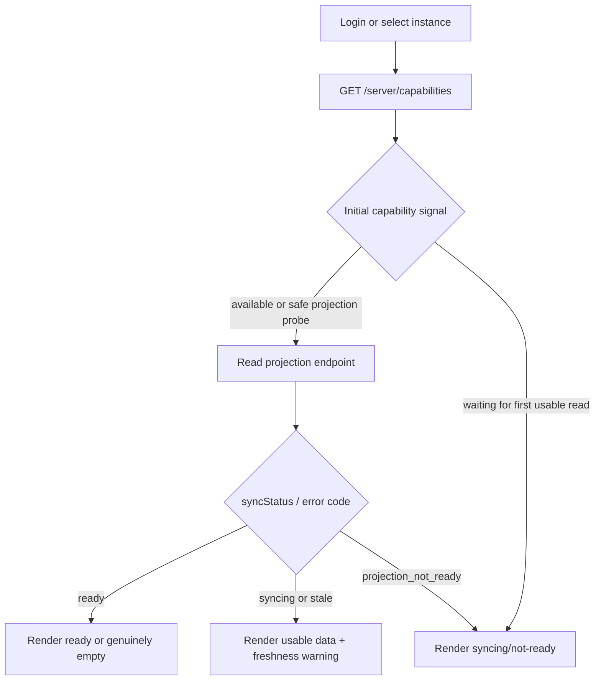

# Architecture

`omniwa-console` is a static, client-only SPA for OmniWA GO's public REST API.
All business rules, persistence, WhatsApp access, reconciliation, rate limiting,
consent enforcement, and campaign execution belong to the backend.



The browser never talks directly to WhatsApp, PostgreSQL, private Go packages,
or internal queues.

## Layers

Dependencies point downward only:

| Layer | Path | Owns | May import |
| --- | --- | --- | --- |
| App shell | `src/app/` | Router, providers, layout, navigation, connect flow | features, components, api, lib |
| Features | `src/features/<panel>/` | Page, panel-specific components, TanStack Query hooks | components, api, lib |
| Shared components | `src/components/` | Tables, drawers, dialogs, feedback, projection notices | api types, lib |
| API boundary | `src/api/` | Client factory, generated types, adapters, resource calls, query keys | lib |
| Utilities | `src/lib/` | Session storage, formatting, small framework-independent helpers | no higher layer |

Rules enforced by `pnpm architecture:check`:

- no network access outside `src/api/`;
- no feature-to-feature imports;
- no feature-owned application `main` landmark;
- no ad hoc feature query-key arrays or duplicated session-scope constants;
- generated API files remain machine-owned.

Shared behavior moves down into components, API, or lib. It is not copied
between features.

## Contract boundary

The vendored contract is `contracts/omniwa-go.openapi.json`, converted from
`../omniwa-go/docs/swagger.json` by `pnpm contract:sync`. Generated TypeScript
types are committed at `src/api/generated/schema.d.ts`.

The public boundary is `METHOD /path`, because the OmniWA GO Swagger does not
define operation IDs. `docs/PANELS.md` assigns each consumed operation to its
panel. Backend source may be inspected to clarify runtime behavior, but no Go
package, model, or private route crosses into the SPA.

## Credential scopes

The active session contains one runtime origin and one `apikey`. Admin calls use
the session client. Instance operations use a scoped client created from the
instance token. Secrets are never placed in URLs, query keys, logs, analytics,
feedback, or generated static assets.

See `docs/AUTH_AND_SESSION.md`.

## State ownership

- **Server state:** TanStack Query only. No hand-rolled resource cache.
- **Projection freshness:** response `meta`; never inferred from collection
  length.
- **URL state:** filters, opaque cursors, selected instance/resource, open panel
  modes, and other shareable operator context.
- **Local component state:** transient form input and disclosure state only.
- **Durable history:** backend Events and Campaign Audit APIs, never toast or
  local-storage history.

Mutations invalidate the narrowest affected query keys after acknowledgement.
Important lifecycle and send state is not optimistic.

## Capability and projection flow



No branch falls back to a WhatsApp-live read.

Capability polling must not erase a usable projection snapshot. Once a read
returns data, its `meta.syncStatus` (or a later `projection_not_ready` error) is
the resource-state authority.

## Shared UI systems

### Tables

List panels use `src/components/data-table/`. The shared system owns responsive
geometry, sticky columns, loading/error/empty rows, mobile summaries, selection
semantics, and overflow cues. Features own typed columns, filters, rows, and URL
state. Panel-specific table breakpoints or duplicate shells are not allowed.

### Drawers

Resource inspectors use `src/components/drawer/DetailDrawer`. The shared shell
owns overlay behavior, focus trap/restoration, Escape, responsive placement,
header identity, and state geometry. Features own resource facts and commands.

### Dialogs

Forms and confirmations use `src/components/dialog/ModalDialog` and shared
confirmation components. Destructive or high-impact actions require explicit
confirmation proportional to risk. Pending actions cannot be submitted twice.

### Feedback

Transport conditions, scoped failures, command acknowledgements, projection
freshness, and toasts follow `docs/FEEDBACK.md`. Features do not implement
custom toast queues, retry timers, or transport banners.

`pnpm design:check` protects the shared table, drawer, dialog, and workspace
contracts.

## Realtime and polling

OmniWA GO's `/ws` requires the global admin key and is not opened by this SPA.
Projection reads and bounded polling provide current state; `/events` provides
durable history and future reconnect recovery. A future browser-safe realtime
bridge may invalidate query keys but must not write provider payloads directly
into caches. See `docs/REALTIME.md`.

## Error and safety posture

- Normalize failures once in `src/api/envelopes.ts`.
- Keep known 429 and projection-not-ready conditions machine-readable.
- Preserve usable stale snapshots when refresh fails.
- Never expose credentials, raw provider payloads, stack traces, or reconstructed
  redacted identities.
- Render only contract-supplied identifiers needed by the operator workflow.
- Do not automatically retry mutations or duplicate campaign/send execution.

## Routing

```text
/connect
/overview
/instances/:instanceId?
/groups/:instanceId?
/chats/:instanceId?/:chatId?
/messages
/messages/new
/events
/queue
/webhooks/:webhookId?
/settings
/settings/api-keys
```

`docs/PANELS.md` is authoritative for whether a route is wired, pending, or
unsupported. Unsupported routes remain explicit unavailable surfaces until a
public API exists; they are never backed by fabricated browser state.

## Build and bundle gates

`pnpm check` runs documentation, design, contract, architecture, TypeScript,
production build, and bundle checks. Route-level splitting must remain intact
and raw JavaScript chunks must stay under the documented 300 KiB budget.
