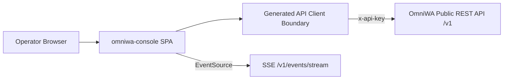

# Architecture

## Style

`omniwa-console` is a client-only single-page application. There is no
server-side code in this repository. The build output is static assets served
by any web server; all platform state lives in OmniWA and is fetched at
runtime through the public REST API.



## Layers

Dependencies point downward only. A layer may import from layers below it,
never above.

| Layer | Path | Owns | May import |
| --- | --- | --- | --- |
| App shell | `src/app/` | Router, layout, providers, navigation, connect screen wiring | features, components, api, lib |
| Features | `src/features/<panel>/` | One directory per panel: pages, panel-specific components, query hooks | components, api, lib |
| Components | `src/components/` | Reusable presentational components (tables, badges, empty states, envelope-aware list views) | lib |
| API boundary | `src/api/` | Generated types, typed client factory, envelope helpers, query-key conventions, SSE client | lib |
| Lib | `src/lib/` | Session storage, formatting, small utilities | (nothing internal) |

Rules:

- Feature code never imports another feature. Shared logic moves down into
  `components/`, `api/`, or `lib/`.
- Only `src/api/` touches the network. Features consume typed hooks and
  helpers; they never construct URLs or headers.
- `src/api/generated/` is machine-written by `pnpm api:generate` and never
  edited by hand.

## Contract-driven boundary

The OpenAPI contract is vendored at `contracts/omniwa-v1.openapi.json` and
synced from the sibling platform repo with `pnpm contract:sync`. The
TypeScript types in `src/api/generated/schema.d.ts` are generated from the
vendored copy, so this repo builds standalone without the platform repo
checked out.

This mirrors the OmniWA Phase J guardrail: platform clients consume the
public OpenAPI surface only. The generated client plays the role the Rust
`omniwa-sdk` plays for `omniwa-tui`.

## State model

- **Server state** is owned by TanStack Query. Every read maps to one
  OpenAPI operation; query keys follow the convention in
  `docs/API_CLIENT.md`. Mutations invalidate the affected keys.
- **Realtime** events from SSE do not write into caches directly; they
  trigger targeted invalidation (see `docs/REALTIME.md`).
- **Session state** (API base URL, API key, key kind) lives in
  `sessionStorage` behind `src/lib/session.ts` (see
  `docs/AUTH_AND_SESSION.md`).
- **UI state** (filters, selected rows, open drawers) lives in URL search
  params first, component state second — panels should be deep-linkable.

## Routing

The messaging workflow is primary; operations panels are secondary:

```
/connect
/chats/:instanceId?/:chatId?         # primary: direct conversations (3-pane)
/groups/:instanceId?                 # primary: group management table
                                     #   ?list=nl_* opens the Named Lists modal
/messages                            # campaigns (proposed contract)
/messages/new                        # campaign wizard (proposed)
/overview
/instances
/instances/:instanceId
/queue
/webhooks
/webhooks/:webhookId
/events
/settings
/settings/api-keys
```

The workspace remembers the last instance + chat in the URL so every
conversation is a shareable deep link. Unauthenticated visits to any route
redirect to `/connect`.

## Error and safety posture

- The API never returns secrets, raw phone/JID, or provider payloads; the
  console renders what the contract provides and adds no client-side
  reconstruction of redacted data.
- Error envelopes surface with their product-safe category and retryability
  flag; the console never shows stack traces or invents error detail.
- The API key is displayed nowhere after entry (see
  `docs/AUTH_AND_SESSION.md`).
